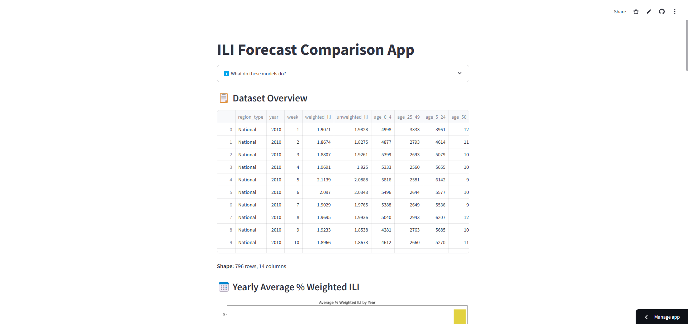

# ILI Forecast Comparison App

This Streamlit web app allows users to visualize influenza-like illness (ILI) trends and compare forecasting models including **Random Forest**, **Linear Regression**, and **XGBoost**.

It also enables users to forecast ILI percentages and estimated case counts for upcoming weeks based on past trends.

## Official Poster


## 🛜 Deployment

The app has been deployed! You can check it out [here](https://ili-forecast-app.streamlit.app/)!



## 📊 Features

- View and explore cleaned ILI dataset.
- Yearly average weighted ILI visualization.
- Train and evaluate three forecasting models.
- Plot actual vs predicted ILI percentages.
- Forecast future ILI trends and download results.
- Compare historical data with forecasts.

## 📁 Dataset

The app use official data from the CDC, which could be found [here](https://gis.cdc.gov/grasp/fluview/fluportaldashboard.html).

Only file `ILINet.csv` is used, and the cleaning script could be found [here](https://github.com/duchieu260503/ili-forecast-app/blob/main/draft_work/data_clean_and_figures.ipynb)

Final dataset being used is `cleaned.csv`. Make sure this file is in the same directory as `app.py`.

## 🚀 Getting Started

### 1. Clone the repository

```bash
git clone https://github.com/duchieu260503/ili-forecast-app.git
cd ili-forecast-app
```

### 2. Install dependencies

Use pip to install all required packages:

```bash
pip install -r requirements.txt
```

### 3. Run the app

```bash
streamlit run app.py
```

## 📦 Requirements

See [`requirements.txt`](./requirements.txt) for all Python package dependencies.

## 📄 License

MIT License. Feel free to use and modify!
